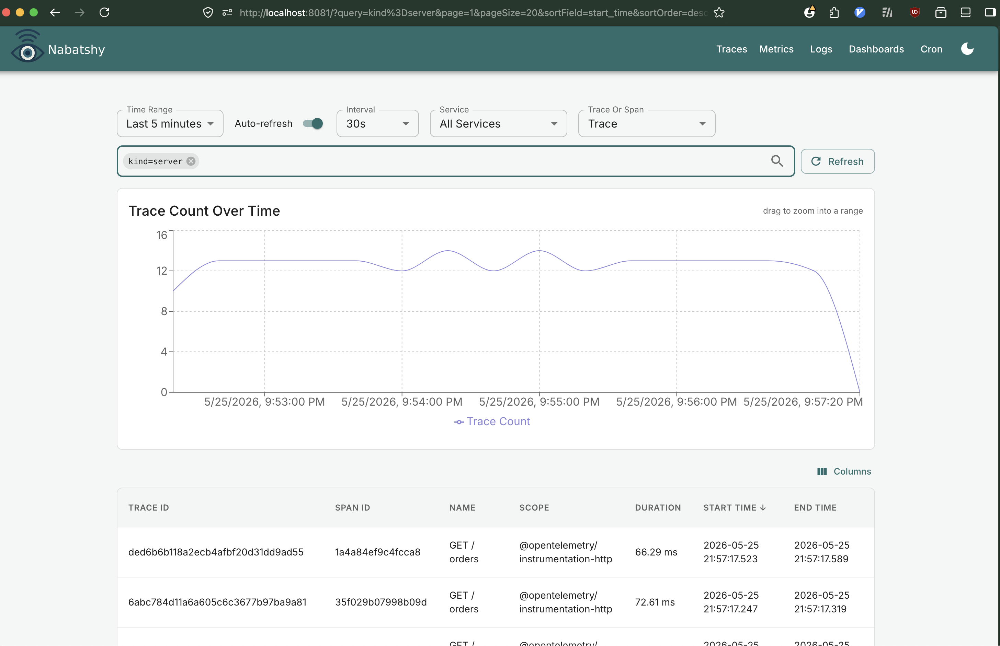
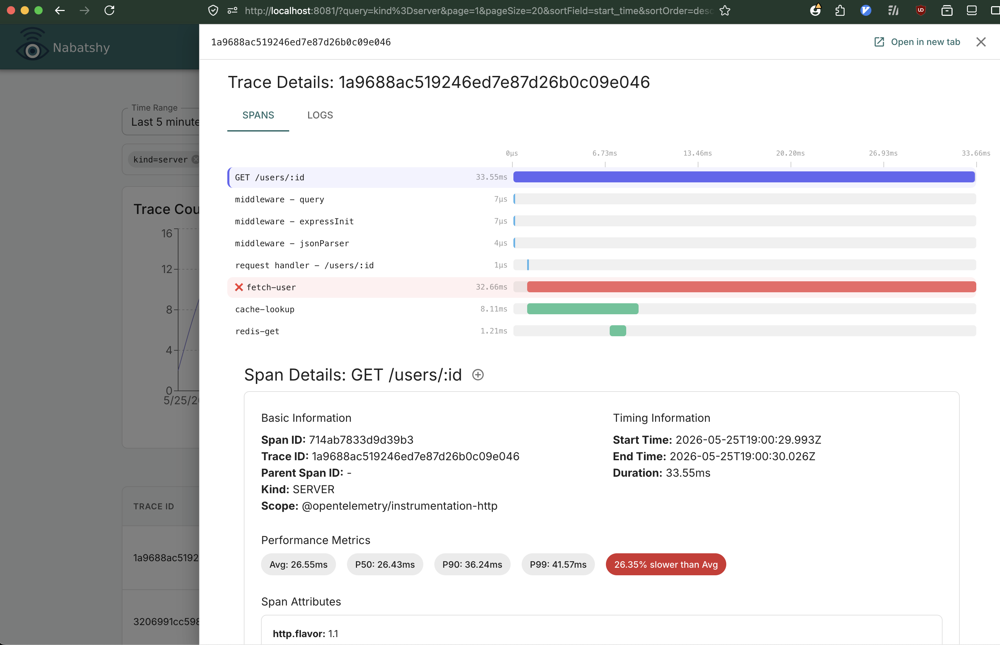
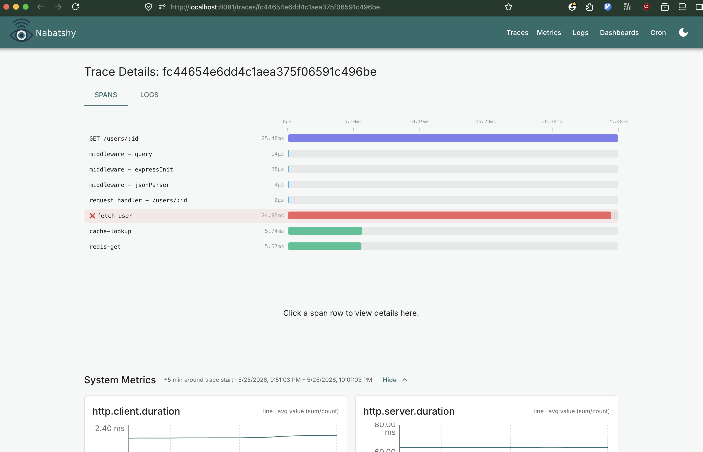
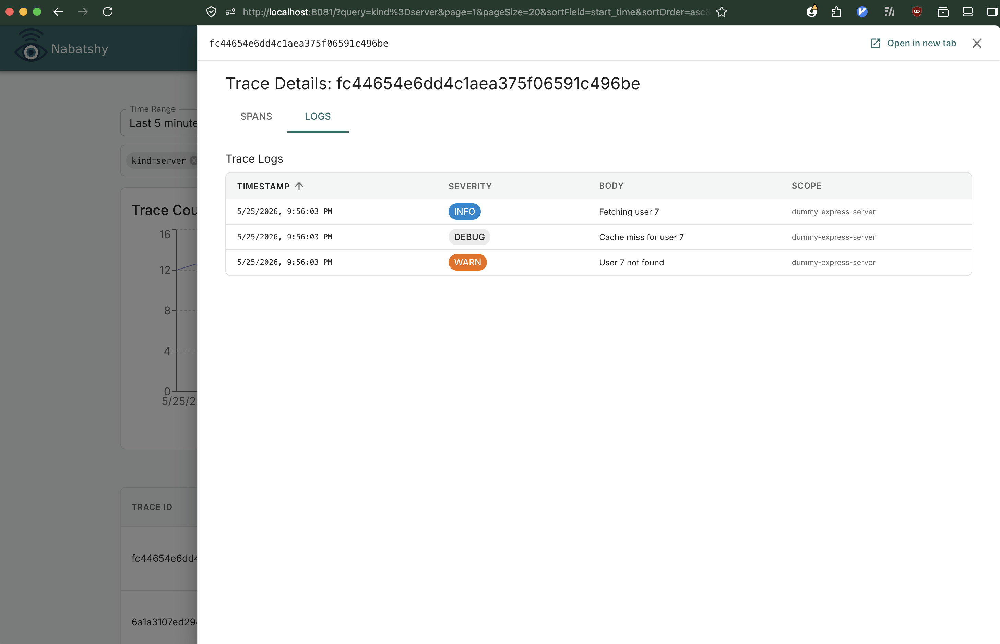
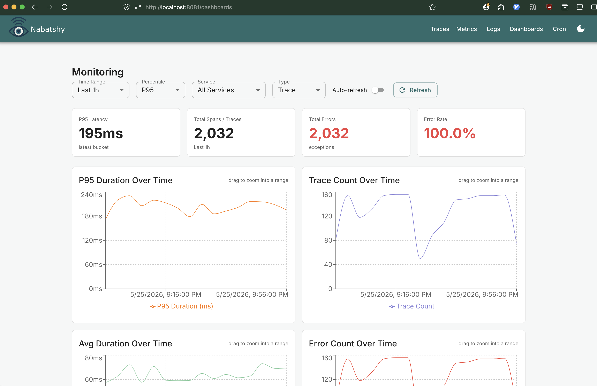
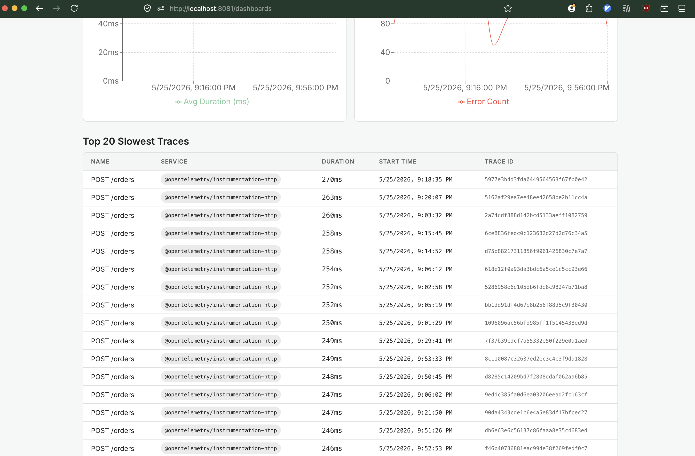
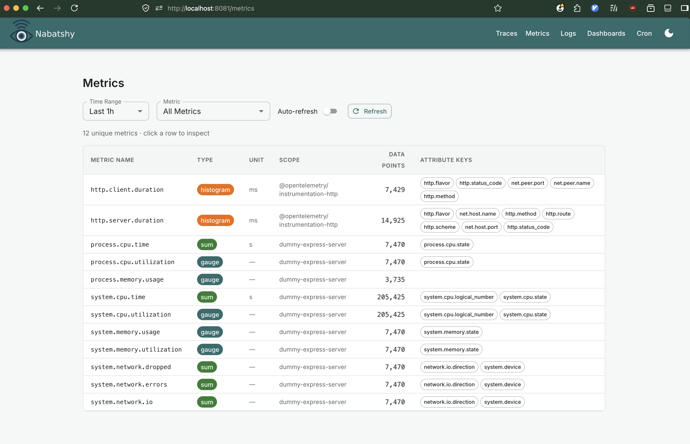
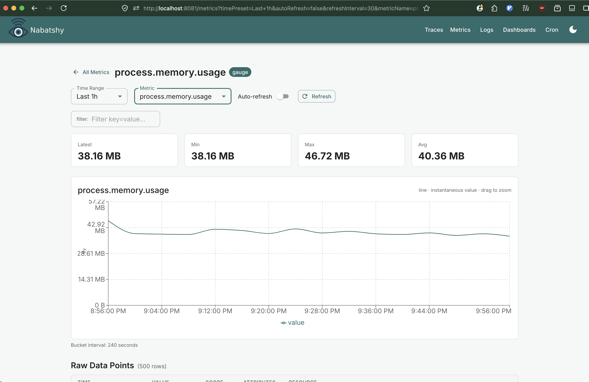
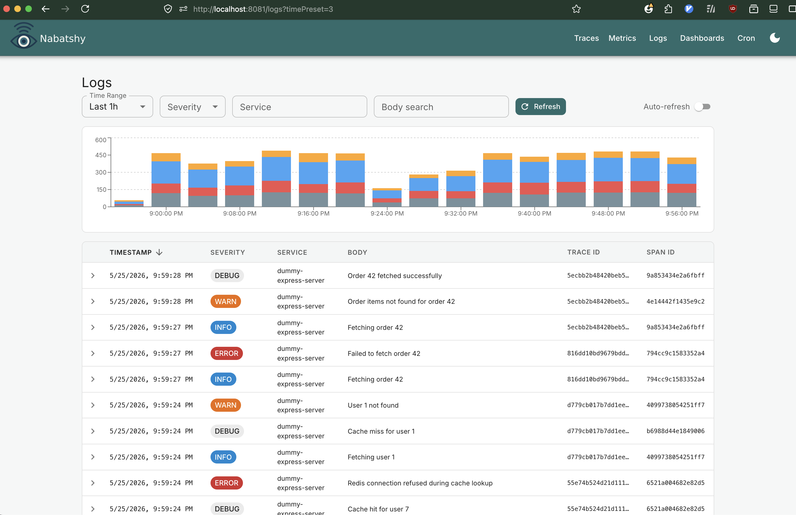
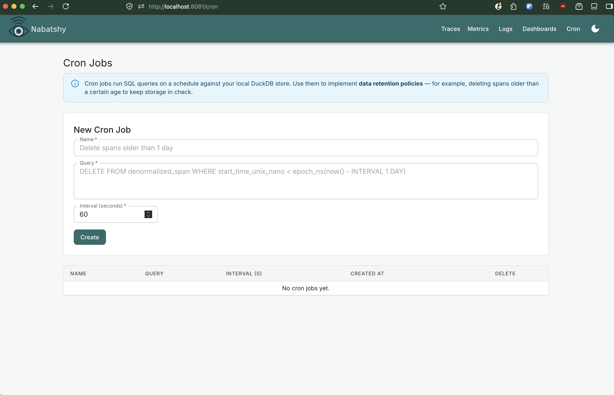

# Nabatshy


**The observability platform that fits in a single binary.**

Drop in a single executable, point your services at it with OpenTelemetry, and get a full observability UI with traces, metrics, logs, and dashboards. No external database. No infrastructure to manage.



## Why Nabatshy

Most observability stacks require running Grafana, Prometheus, and Tempo — or Jaeger backed by Elasticsearch or ClickHouse — before you see a single trace. Nabatshy embeds [DuckDB](https://duckdb.org) directly into the binary, so the entire platform ships as a single executable with a single `.db` file on disk.

Designed for **production apps with moderate traffic, local development, side projects, and internal tools**. Any setup where spinning up a dedicated observability cluster is more overhead than the service it's monitoring. If you need to handle millions of spans per second, use something else. If you want traces working in under a minute, this is for you.

## Features

- **Trace search and filtering** — search by service, operation, duration, and attributes with real-time percentile charts
- **Span timeline visualization** — flame-graph-style span bars with error highlighting and click-to-inspect
- **Service metrics and percentiles** — P50/P90/P99 duration charts, error rates, and throughput trends per service and endpoint
- **OTel metrics** — visualize OTLP metric data points alongside traces
- **Log aggregation with full-text search** — ingest OTLP logs and search bodies with DuckDB's built-in FTS extension
- **Cron-based data retention** — schedule SQL queries to delete old spans and keep storage lean

## How It Works

When you run the binary, three HTTP servers start concurrently:

| Port | Purpose                                                                         |
| ---- | ------------------------------------------------------------------------------- |
| 4318 | OpenTelemetry collector — receives traces, metrics, and logs (JSON or protobuf) |
| 3000 | Query API — serves data to the UI                                               |
| 8081 | UI — serves the embedded React dashboard                                        |

Your services send telemetry to `http://localhost:4318` using any OpenTelemetry SDK. The collector writes data into a local DuckDB file (`nabatshy.db`). The UI at `http://localhost:8081` lets you search traces, inspect spans, query logs, and view metrics.

## Screenshots












## Quick Start

```bash
# 1. Clone and install frontend dependencies
git clone https://github.com/adhamsalama/nabatshy
cd nabatshy

# 2. Build the UI (output gets embedded into the Go binary)
cd ui && npm install && npm run build && cd ..

# 3. Build and run
go build -ldflags="-s -w"
./nabatshy
```

Then point your OpenTelemetry SDK at `http://localhost:4318` and open `http://localhost:8081`.

## Docker

```bash
docker build -t nabatshy .
docker run -p 4318:4318 -p 3000:3000 -p 8081:8081 -v $(pwd)/data:/data nabatshy
```

## Configuration

| Flag          | Env var                 | Default       | Description                           |
| ------------- | ----------------------- | ------------- | ------------------------------------- |
| `--otel-port` | `OTEL_PORT`             | `4318`        | OpenTelemetry collector port          |
| `--api-port`  | `API_PORT`              | `3000`        | Query API port                        |
| `--ui-port`   | `UI_PORT`               | `8081`        | UI server port                        |
| `--db-path`   | `DUCKDB_PATH`           | `nabatshy.db` | Path to the DuckDB data file          |
| `--in-memory` | `DUCKDB_IN_MEMORY=true` | `false`       | Use in-memory DuckDB (no persistence) |
