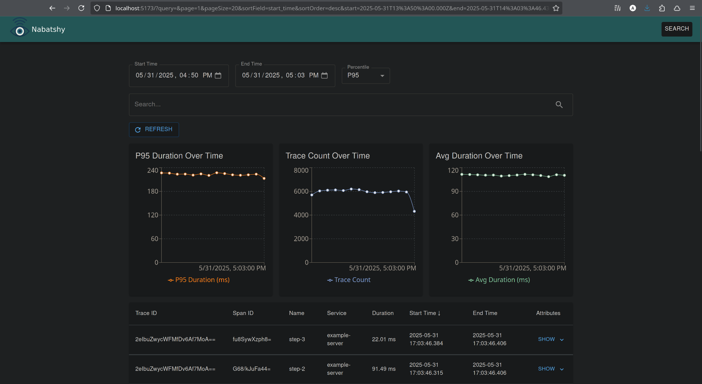
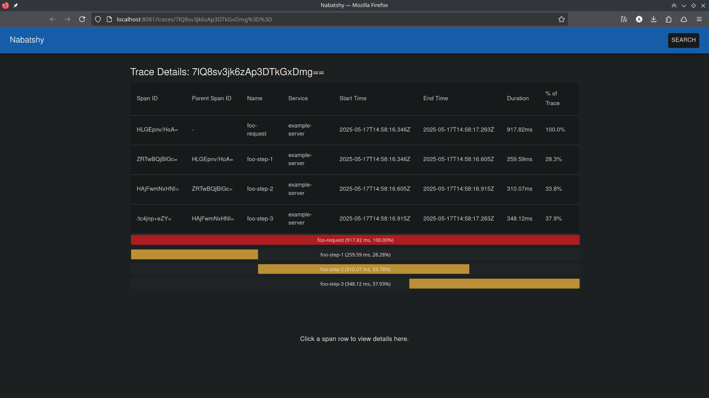
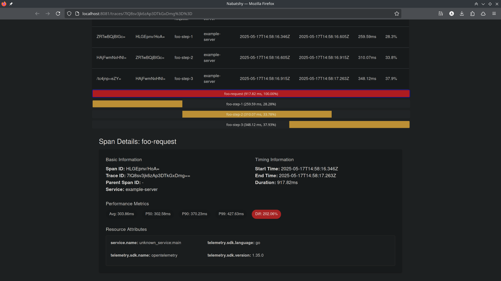

# Nabatshy


Nabatshy is a self-contained observability platform for distributed traces. Drop in a single binary, point your services at it with OTLP, and get a full tracing UI — no external database, no infrastructure to manage.





## Philosophy

Most observability stacks require running Grafana, Prometheus, and Tempo, or Jaeger backed by Elasticsearch or ClickHouse, before you can see a single trace. Nabatshy embeds [DuckDB](https://duckdb.org) directly into the binary, so the entire platform — OTLP ingestion, trace storage, query engine, and UI — ships as a single executable with a single `.db` file on disk.

This is intentionally designed for **small to medium workloads**: production apps with moderate traffic, local development, side projects, and internal tools — any setup where spinning up a dedicated observability cluster is more overhead than the service it's monitoring. If you need to handle millions of spans per second, use something else. If you want traces working in under a minute, this is for you.

## How It Works

When you run the binary, three HTTP servers start concurrently:

| Port | Purpose |
|------|---------|
| 4318 | OTLP collector — receives traces from your services (JSON or protobuf) |
| 3000 | Query API — serves trace and metrics data to the UI |
| 8081 | UI — serves the embedded React dashboard |

Your services send traces to `http://localhost:4318` using any OpenTelemetry SDK. The collector writes spans into a local DuckDB file (`nabatshy.db`). The UI at `http://localhost:8081` lets you search traces, inspect individual spans, and view service metrics over time.

### Trace Ingestion

The collector accepts standard OTLP over HTTP, supporting both `application/x-protobuf` and `application/json` content types. Spans are flattened into a single denormalized table in DuckDB, optimized for the kinds of time-range and attribute filter queries the UI runs. Writes are serialized through a channel to work within DuckDB's single-writer model.

### Query & UI

The React dashboard (built with Vite and MUI) is compiled and embedded directly into the Go binary at build time. At runtime, the Go binary serves it from memory — no separate frontend server or static file directory needed. The UI communicates with the query API on port 3000.

## Build

```bash
# Build the UI first (output gets embedded into the Go binary)
cd ui && npm install && npm run build && cd ..

# Build the binary
go mod download
go build -ldflags="-s -w"
```

## Run

```bash
./nabatshy
```

Then point your OpenTelemetry SDK at `http://localhost:4318` and open `http://localhost:8081`.

## Docker

```bash
docker build -t nabatshy .
docker run -p 4318:4318 -p 3000:3000 -p 8081:8081 -v $(pwd)/data:/data nabatshy
```

## Configuration

Set the path for the DuckDB data file via environment variable (defaults to `nabatshy.db` in the current directory):

```bash
DUCKDB_PATH=/data/nabatshy.db ./nabatshy
```
